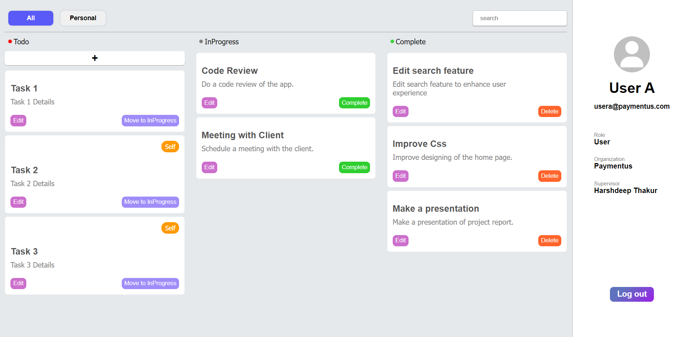

# Task-Manager-App
This is a full stack application made by me in the learning phase of my internship.
This application uses React for frontend.
Node.js, Express.js and MongoDb for backend.
I also used Passport.js as an authentication middleware and Redis for storing session id's.

# Below are the screenshot's of my application.
<h3>Login Page</h3>

<h3>Home Page</h3>

